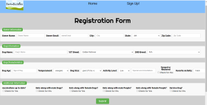
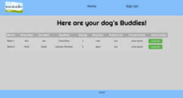
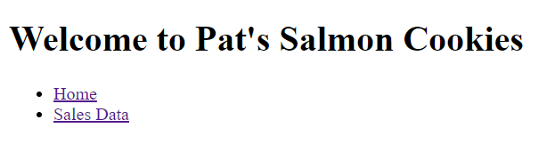
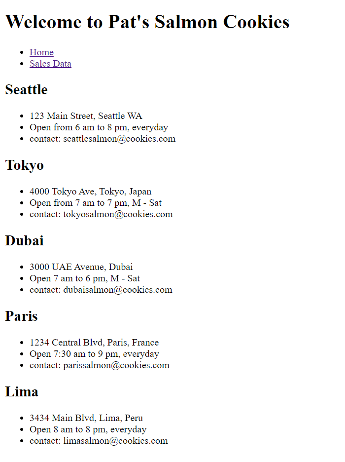
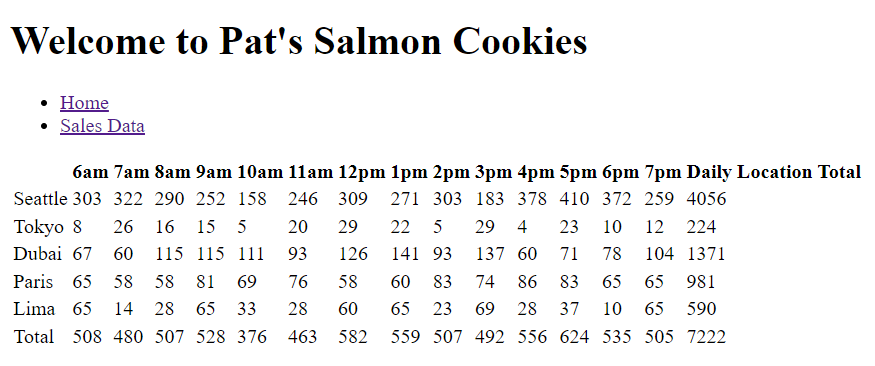
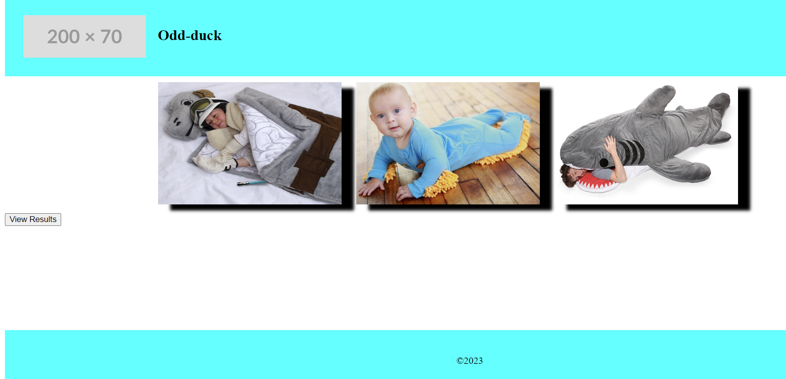
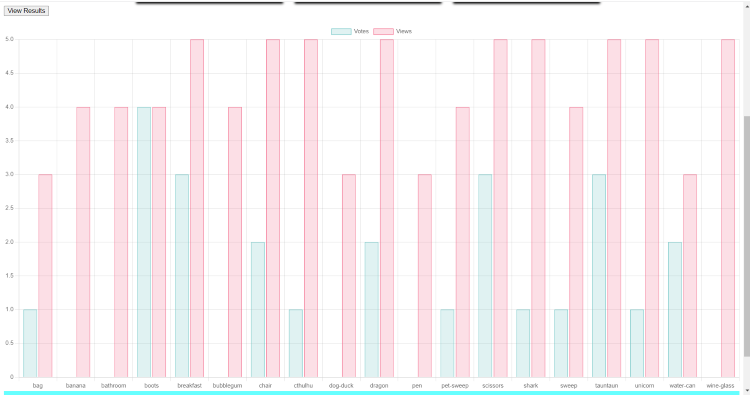
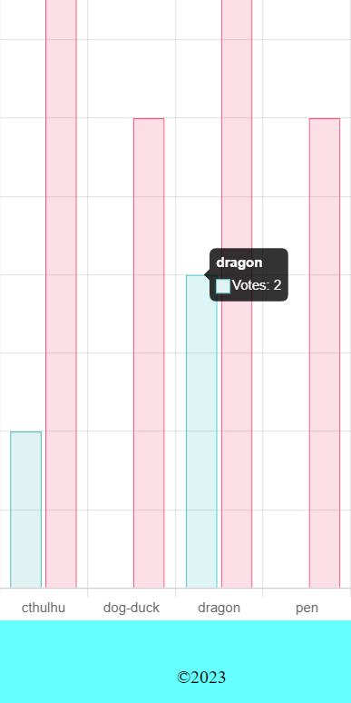

# About me

1. Aspring Software Developer

2. I am open to learning, and eager to continue getting better and becoming a better software developer everyday.

3. As a software developer with a real estate agent background, I bring valuable skills in marketing, sales, market analysis, emotional intelligence, negotiation, business acumen, customer service, and attention to detail. My marketing and sales experience allows me to understand user needs and create user-friendly software. Additionally, my emotional intelligence and negotiation abilities facilitate effective communication, collaboration, and empathy with end-users. In the tech industry, this diverse skill set positions me to create innovative, user-focused software solutions.

4. What excites me is being at the front of the tech revolution. Mostly everything we deal with now involves software, and that will only increase in the future. I want to learn, grow, and develop as much as I can in tech and pursue my passions.

## Three screenshots of code 201 final project (bark buddies)

## Three screenshots of salmon cookies

## Three screenshots of odd-duck

